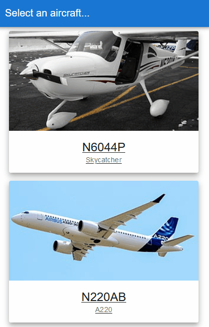

# Flying Checklist

This is a React application that digitizes the paper checklist commonly used by pilots. An aircraft owner/operator populates the backend database with information regarding the aircraft in their fleet (e.g. tail number, make, model and a link to an image of the aircraft), as well as checklist items categorized by phase of flight. The user has the capability to add new checklist items as well using the New Item Form.

## Installation

**Note: This is the front-end of the application only. For it to work properly, you must also install and run the backend, [found here](https://github.com/NicMortelliti/checklist-backend).**

Clone this repo to a local directory.

Use the package manager [npm](https://www.npmjs.com/) to install the dependencies.

```bash
$ npm install
```

Finally, start the server on port 3001. TIP: Start the backend server first, this will force server.js to find the next open port, which will likely be 3001.

```bash
$ npm start
```

## Usage



### Displaying a checklist

In a web browser, navigate to localhost:3001.

Select an aircraft card from the list of aircraft.

Select a phase card from the list of flight phases.

When a checklist item is completed, select the associated response button (e.g. CHECK, VERIFY, EXTEND, etc.) to mark it as complete.

### Adding a new checklist item

With a checklist displayed, you may add a new checklist item to the current list by selecting the "+" button in the lower-right corner of the checklist.

Confirm the form subtitle displays the aircraft and flight phase you intend to add to.

Enter a checklist item description (e.g. "Landing Gear", "Fuel Selector", "Passenger Briefing", etc.) in the "Call" field.

Select the appropriate response to the checklist item in the "Response" field.

Select the Submit button. The new checklist item will be added to the database and populated on the checklist page.

### Emergency

The emergency checklist can be accessed two ways. You can navigate there the normal way (i.e. Select aircraft, select flight phase, in this case "Emergency"). Or, you may select the Emergency button at the top-left of the page.

**Note: The red emergency button is only displayed when an aircraft is selected.**

## Acknowledgements

### Cessna Skycatcher Image:

[Ahunt, Public domain, via Wikimedia Commons](https://upload.wikimedia.org/wikipedia/commons/thumb/4/4b/Cessna_162_Skycatcher_N5201K_0998.JPG/320px-Cessna_162_Skycatcher_N5201K_0998.JPG)

### Airbus A220 Image:

[Romain COUPY, CC BY-SA 4.0 <https://creativecommons.org/licenses/by-sa/4.0>, via Wikimedia Commons](https://upload.wikimedia.org/wikipedia/commons/thumb/8/8c/Airbus_A220-300.jpg/320px-Airbus_A220-300.jpg)

## License

[MIT](https://choosealicense.com/licenses/mit/)
